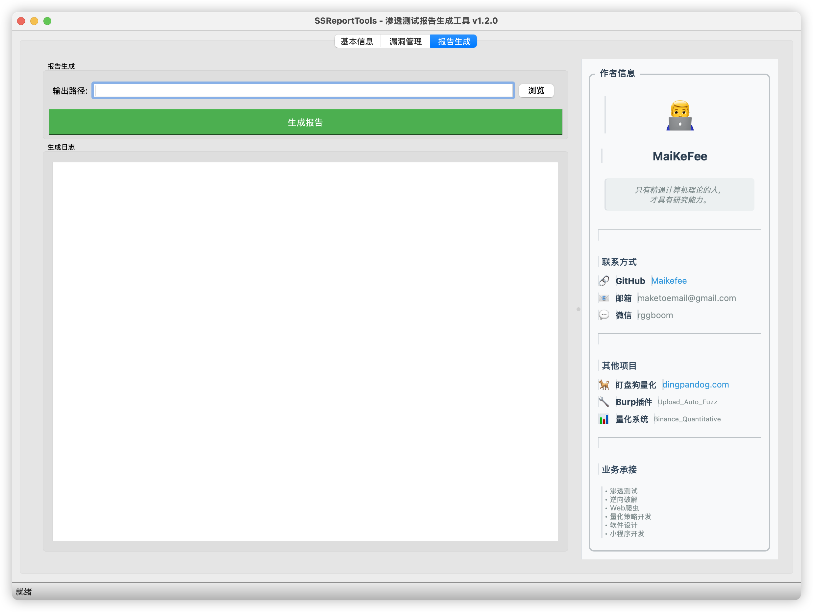
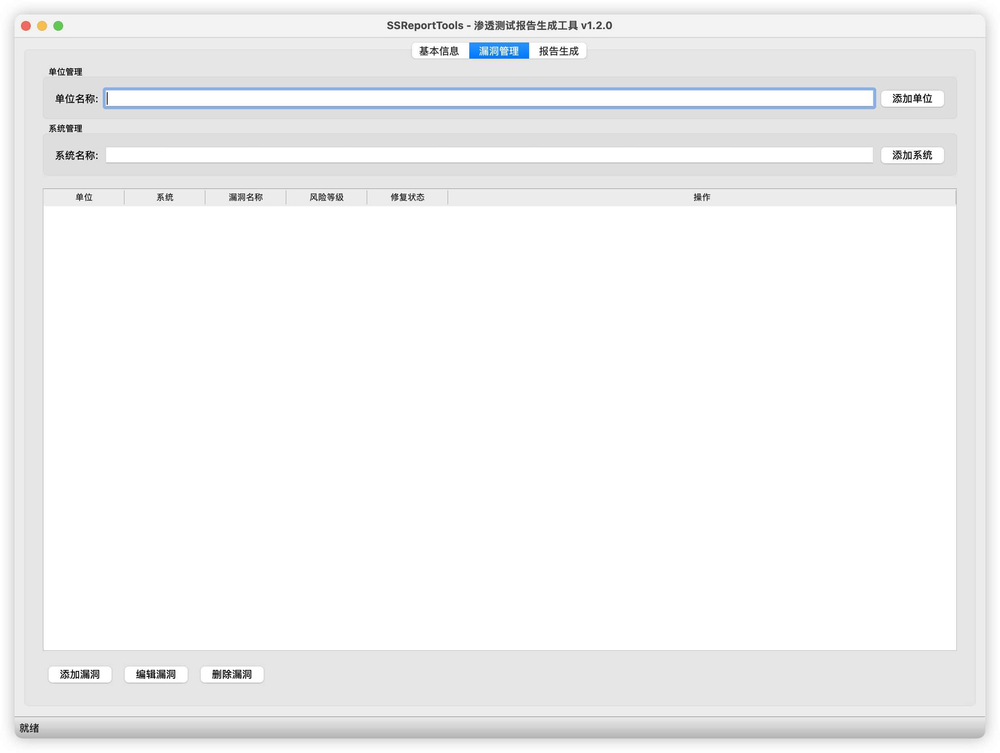
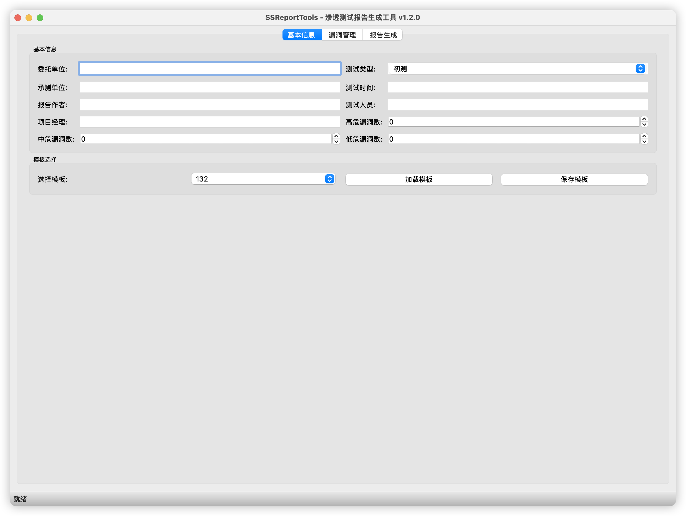

# SSReportTools - 渗透测试报告生成工具

[](https://github.com/Maikefee/)
[](https://github.com/Maikefee/)
[](https://github.com/Maikefee/SSReportTools)

## 简介

SSReportTools是一个基于Python PyQt5开发的渗透测试报告生成工具，用于快速生成专业的渗透测试报告。

**作者**: MaiKeFee  
**GitHub**: [https://github.com/Maikefee/](https://github.com/Maikefee/)  
**邮箱**: maketoemail@gmail.com  
**微信**: rggboom  

> 只有精通计算机理论的人，才具有研究能力。

## 功能特性

- **图形化界面**: 基于PyQt5的现代化图形用户界面
- **模板管理**: 支持多种报告模板，可自定义和保存
- **专业漏洞库**: 基于狼组安全团队知识库，包含30+专业漏洞信息
  - OWASP Top 10 2021 完整漏洞类型
  - 常见Web安全漏洞详细说明
  - 专业的危害描述和修复建议
- **完整漏洞管理**: 支持漏洞的增删改查操作
  - 智能添加漏洞（选择单位、系统、漏洞类型）
  - 编辑漏洞信息（修复状态、风险等级）
  - 安全删除漏洞（确认对话框防误删）
- **报告生成**: 自动生成Word格式的渗透测试报告
- **数据管理**: 支持单位、系统、漏洞的层级管理

## 安装要求

- Python 3.7+
- PyQt5
- python-docx
- PyYAML

## 安装步骤

### 自动安装（推荐）

**Linux/macOS:**
```bash
chmod +x install.sh
./install.sh
```

**Windows:**
```cmd
install.bat
```

### 手动安装

1. 克隆或下载项目到本地
2. 安装依赖包：
   ```bash
   pip install -r requirements.txt
   # 或使用 pip3
   pip3 install -r requirements.txt
   ```

## 使用方法

### 启动应用

**Linux/macOS:**
```bash
./start.sh
# 或
python3 run.py
```

**Windows:**
```cmd
start.bat
# 或
python run.py
```

**直接运行:**
```bash
python3 main.py
```

### 基本操作流程

1. **基本信息设置**
   - 在"基本信息"标签页中填写委托单位、测试类型、承测单位等信息
   - 选择或创建报告模板
   - 保存模板供后续使用

2. **漏洞管理**
   - 在"漏洞管理"标签页中添加单位和系统
   - 为每个系统添加发现的漏洞
   - 设置漏洞的修复状态

3. **报告生成**
   - 在"报告生成"标签页中选择输出路径
   - 点击"生成报告"按钮
   - 等待报告生成完成








## 项目结构

```
SSReportTools-1.0.0/
├── main.py                 # 主程序文件
├── run.py                  # 启动脚本
├── requirements.txt        # 依赖包列表
├── README.md              # 说明文档
├── config/                # 配置文件目录
│   ├── VulnWiki.yml       # 漏洞库文件
│   └── templates/         # 模板文件目录
│       ├── 132.json
│       ├── XX测试公司1.json
│       └── 测试公司.json
├── components/            # 报告组件文件
│   ├── first_level_heading.txt
│   ├── second_level_heading.txt
│   ├── third_level_heading.txt
│   ├── fourth_level_heading.txt
│   └── normal_text.txt
├── templates/             # Word模板文件
└── docs/                  # 生成的报告文件
```

## 配置说明

### 漏洞库配置 (config/VulnWiki.yml)

漏洞库基于[狼组安全团队公开知识库]，包含30+专业漏洞信息：

**OWASP Top 10 2021 漏洞类型:**
- A01:2021-访问控制失效
- A02:2021-加密失败  
- A03:2021-注入漏洞
- A04:2021-不安全设计
- A05:2021-安全配置错误
- A06:2021-使用有漏洞和过时的组件
- A07:2021-身份认证失败
- A08:2021-软件和数据完整性失败
- A09:2021-安全日志和监控失败
- A10:2021-服务器端请求伪造

**常见Web安全漏洞:**
- SQL注入、XSS、CSRF、文件上传漏洞
- 文件包含、命令注入、信息泄露
- 逻辑漏洞、SSRF、XXE、不安全的反序列化
- 会话固定、点击劫持、目录遍历等

漏洞库使用YAML格式，包含详细的危害描述和修复建议：

```yaml
vulnerabilities:
- name: A01:2021-访问控制失效
  harm: 可能导致未授权访问敏感数据或功能，造成数据泄露、权限提升等严重后果
  description: 访问控制失效是指应用程序未能正确实施访问控制策略...
  risklevel: 高危
  suggustion: |
    1、实施最小权限原则，确保用户只能访问其职责范围内的资源；
    2、对所有敏感功能实施严格的访问控制检查；
    3、使用基于角色的访问控制（RBAC）模型；
    4、定期审查和测试访问控制机制；
    5、实施多因素认证（MFA）增强安全性。
```

### 模板配置 (config/templates/*.json)

模板文件使用JSON格式，包含报告的基本信息：

```json
{
  "clientName": "XX测试公司",
  "isFirstTest": "初测",
  "contractorName": "XX安全公司",
  "testDate": "2025年7月1日至2025年7月7日",
  "reportYear": "2025",
  "reportMonth": "08",
  "reportDay": "08",
  "reportAuthor": "张三",
  "tester": "李四",
  "manager": "王五",
  "highVuln": "1",
  "midVuln": "2",
  "lowVuln": "3"
}
```

## 开发说明

### 主要类说明

- `VulnerabilityManager`: 漏洞库管理器，负责加载和管理漏洞信息
- `TemplateManager`: 模板管理器，负责加载和管理报告模板
- `ReportGenerator`: 报告生成器，负责生成Word格式的报告
- `MainWindow`: 主窗口类，包含所有UI组件和业务逻辑

### 扩展功能

如需添加新功能，可以：

1. 在相应的管理类中添加新方法
2. 在MainWindow中添加新的UI组件
3. 在ReportGenerator中扩展报告生成逻辑

## 注意事项

1. 确保config目录下的配置文件格式正确
2. 生成的Word文档需要Microsoft Word或兼容软件打开
3. 建议定期备份模板和配置文件
4. 如遇到问题，请检查Python环境和依赖包版本

## 许可证

本项目仅供学习和研究使用。

## 联系方式

如有问题或建议，请通过以下方式联系：

**作者**: MaiKeFee  
**GitHub**: [https://github.com/Maikefee/](https://github.com/Maikefee/)  
**邮箱**: maketoemail@gmail.com  
**微信**: rggboom  

### 其他项目

- **盯盘狗量化**: [https://www.dingpandog.com](https://www.dingpandog.com)
- **Burp插件**: Upload_Auto_Fuzz_Burp_Plugin, Fofa_Google_Plugin
- **量化系统**: Binance_Quantitative_System

### 业务承接

- 渗透测试
- 逆向破解  
- Web爬虫
- 量化策略开发
- 软件设计
- 小程序开发
